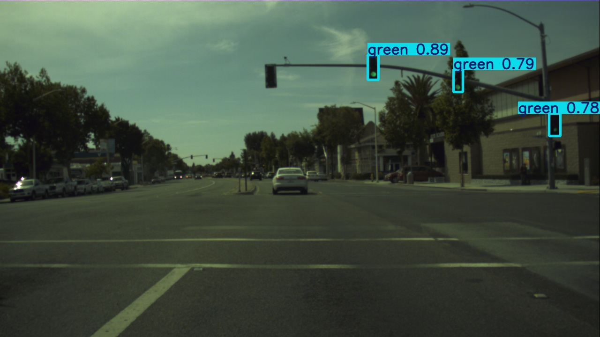
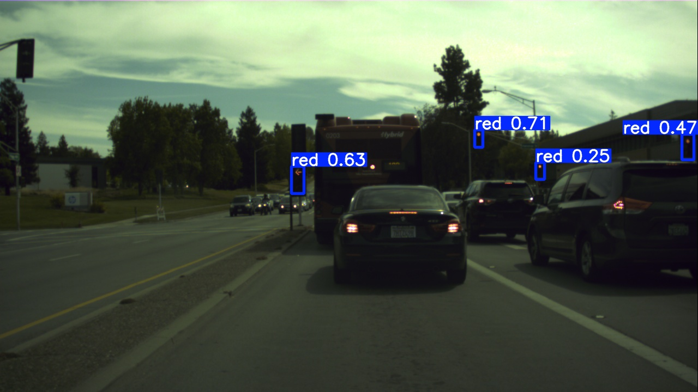
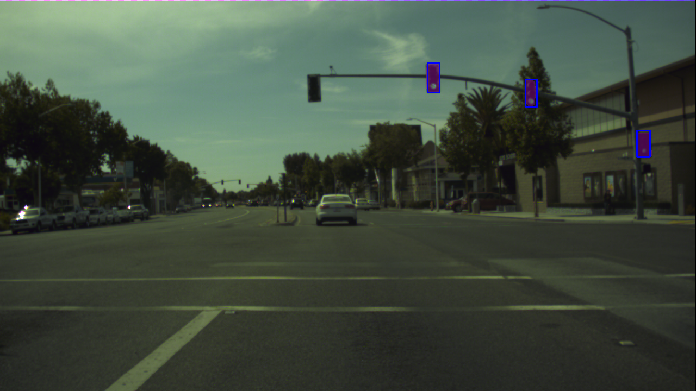
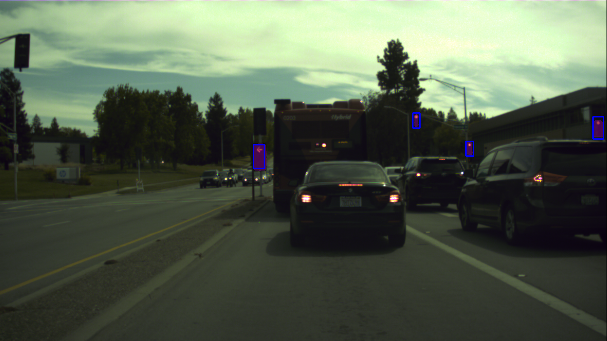
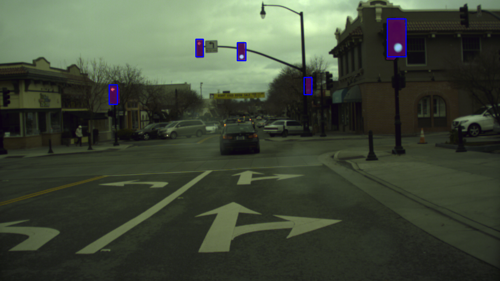

# Hybrid Detection and Segmentation of Small Traffic Lights using YOLOv8 and SAM

Small traffic light detection project using YOLOv8 for detection and SAM for segmentation.

## Dataset
- **[BOSCH Dataset](https://hci.iwr.uni-heidelberg.de/content/bosch-small-traffic-lights-dataset)**
- Contains images and bounding boxes for traffic lights.

## Model Output
| Model        | Precision |  Recall  | mAP@0.5  | mAP@0.5:0.95 | Notes                      |
|--------------|-----------|----------|----------|--------------|--------------------------- |
| Red          | 0.77      | 0.52     |  0.58    |  0.30        | Common false positive      |
| Green        | 0.83      | 0.70     |  0.73    |  0.38        | High recall & precision    |
| All          | 0.80      | 0.61     |  0.66    |  0.34        | Faster inference (≈149 FPS)|

**Read the full article [here](https://medium.com/@monishatemp20/yolov8-for-small-object-detection-real-world-use-case-on-traffic-lights-f3bbe95c742d)**

## Sample Predictions

### Detection

### Segmentation

### Detection (False positive)

