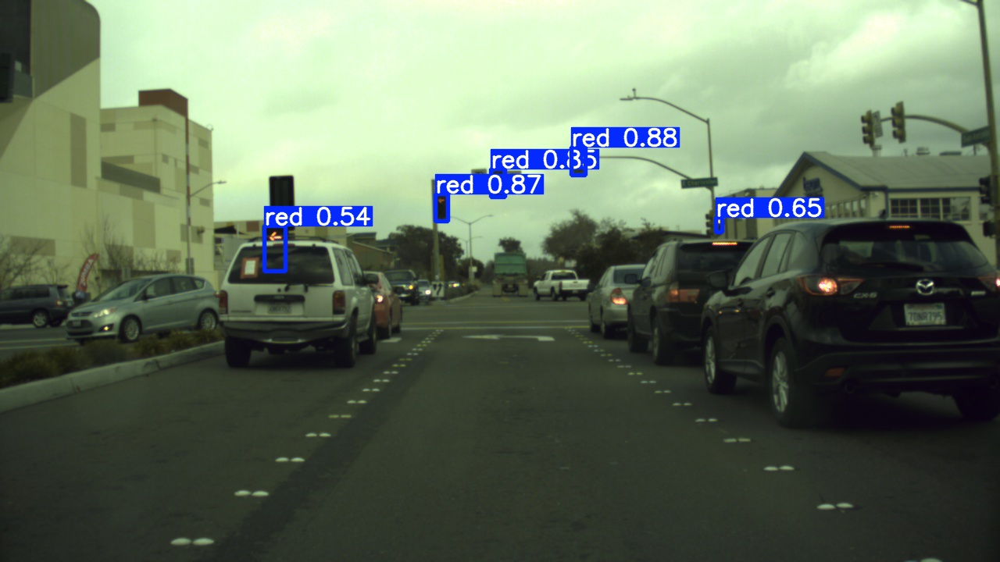
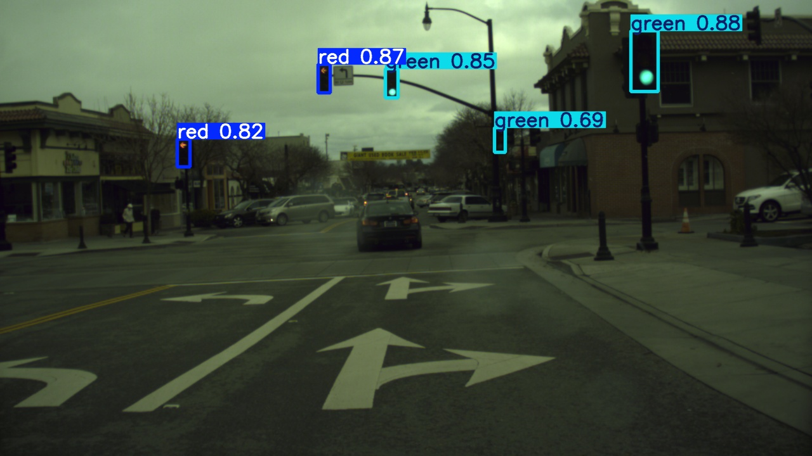
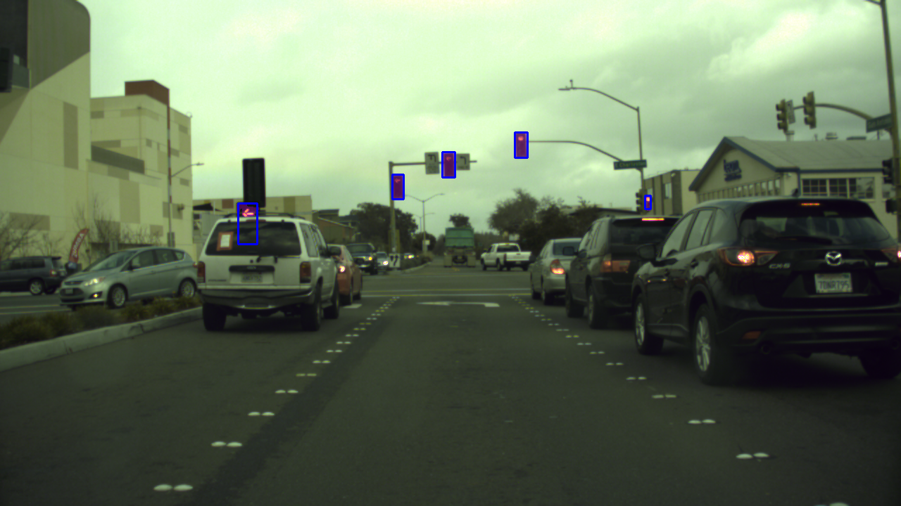
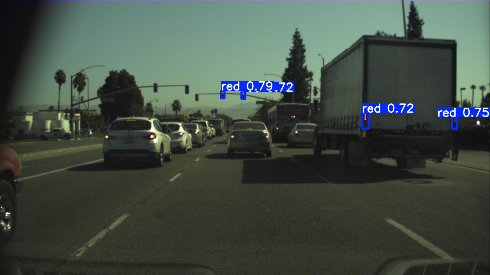

#  Hybrid Detection and Segmentation of Tiny Traffic Lights with YOLOv8 and SAM

Small traffic light detection project using YOLOv8 for detection and SAM for segmentation.

> **Read the full write-up on Medium**:  
> [Hybrid Detection and Segmentation of TinyTraffic Lights with YOLOv8 and SAM](https://medium.com/@monishatemp20/yolov8-for-small-object-detection-real-world-use-case-on-traffic-lights-f3bbe95c742d)

## Dataset
- **[BOSCH Dataset](https://hci.iwr.uni-heidelberg.de/content/bosch-small-traffic-lights-dataset)**
- Contains images and bounding boxes for traffic lights.

## Model Output (Detection via YOLOv8n)
| Model        | Precision |  Recall  | mAP@0.5  | mAP@0.5:0.95 | Notes                      |
|--------------|-----------|----------|----------|--------------|--------------------------- |
| Red          | 0.83      | 0.56     |  0.68    |  0.38        | Common false positive      |
| Green        | 0.91      | 0.77     |  0.80    |  0.43        | High recall & precision    |
| All          | 0.87      | 0.67     |  0.74    |  0.41        |                            |

## Model Output (Segmention via YOLOv8n/s)
| Model       | Params | GFLOPs | Box mAP50 | Box mAP50-95 | Mask mAP50 | Mask mAP50-95 |
| ----------- | ------ | ------ | --------- | ------------ | ---------- | ------------- |
| YOLOv8s-seg | 11.8M  | ~42    | 0.86      | 0.75         | 0.07       | 0.0125        |
| YOLOv8n-seg | 3.2M   | ~12    | 0.83      | 0.73         | 0.02       | 0.00747       |

Note: These results may also be affected by annotation quality. Precisely annotating small objects with pixel-wise accuracy is challenging and can impact segmentation metrics.

## Evaluation Result (YOLOv8 + SAM on Bosch Traffic Light)
| Total GT Objects Evaluated | Matched (IoU > 0.05) | Mean IoU | 
| ---------------------------| ---------------------| ---------| 
| 1186                       | 275                  | 0.0757   | 

This is a baseline result using:
- YOLOv8-predicted bounding boxes
- Center points as SAM prompts
- No fine-tuning or post-processing

### Future Directions
- Improve prompts (e.g., color or brightness-based points)
- Refine bounding boxes for tighter object fit
- Apply post-processing to clean predicted masks

## Sample Predictions for Detection (via YOLOv8n) & Segmentation (via SAM)

### Detection (YOLOv8n)

### Segmentation (SAM)

### Detection (False positive)

## Author

**Monisha**  
Connect via [Medium](https://medium.com/@monishatemp20)  

---
